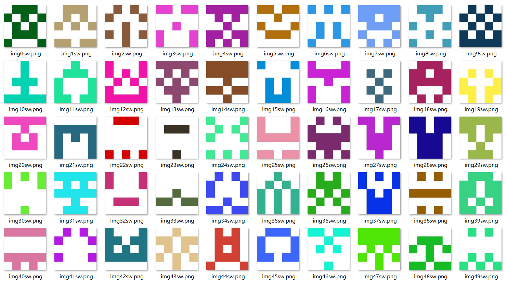
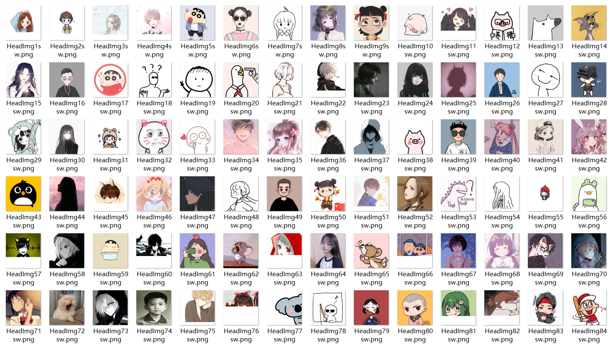

# 说明

headUrl1中的头像是爬下来的矩阵点图，预览如下：

headUrl2中的头像是爬下来的卡通图，预览如下：

tiny后缀的是缩小图

## github上存储的图像

链接地址：

Url1系列的链接 https://raw.githubusercontent.com/youngsw/Head-Img/master/headUrl1/img0sw.png

Url2系列的链接 https://raw.githubusercontent.com/youngsw/Head-Img/master/headUrl2/HeadImg1sw.png

更改/headUrl1文件夹的名字可以获取不同系列的头像

Url1中的数字后缀的范围为0-999

Url2中的数字后缀的范围为1-171

---

## 七牛云上存储的图像
Url1系列的链接 http://q4auui9hp.bkt.clouddn.com/headUrl1/img0sw.png

Url2系列的链接 http://q4auui9hp.bkt.clouddn.com/headUrl2/HeadImg1sw.png

更改/headUrl1文件夹的名字可以获取不同系列的头像

Url1中的数字后缀的范围为0-999

Url2中的数字后缀的范围为1-171

